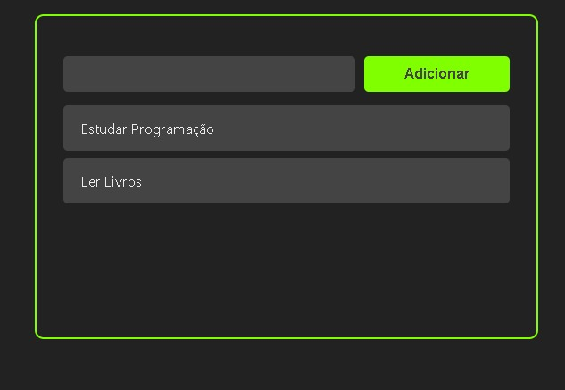

# Gerenciador de Tarefas

<!---Esses são exemplos. Veja https://shields.io para outras pessoas ou para personalizar este conjunto de escudos. Você pode querer incluir dependências, status do projeto e informações de licença aqui--->




> Pequena aplicação web para anotação de tarefas (To do list). Desenvolvida com o intuito de exercitar conceitos basicos em React.


```

